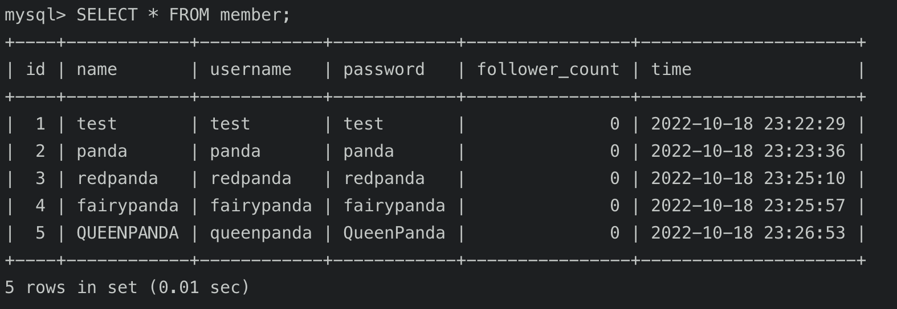

## SQL CRUD

+ INSERT one data where has to be the word 'test' in both username and password columns, and other four free data into the "member" table.
>        
  
+ Use SELECT to see all data from the "member" table
>   
  
+ SELECT all data from the "memeber" table and sort them in descending oder by the "time" column.
> 

+ SELECT data 2~4 from the "member" table and sort them by the "time" column in descending order.
> 

+ SELECT the data where username is 'test' from the "member" table
> 

+ SELECT the data where both username & passord are 'test'.
> 

+ UPDATE "test2" on the "name" coloumn whose username is 'test'.
> 
> 

## SQL Aggregate Functions
#### Update "follower_count" column for later calculation
> 

+ How many members in the "member" table?
> 

+ The sum of "follower_count" column in the "member" table.
> 

+ The Average of "follower_count" column in the "member" table.
> 

## SQL JOIN
+ CREATE "message" table
> 

+ The "message" table after INSERT some data
> 

+ SELECT members' name and their message content by JOIN the "member" & "message" table.
> 

+ SELET the name and the content by JOIN the "member" & "message" table ON whose username is "test".
> 

+ SELECT and JOIN to get the average "like_count" of the username "test".
> 

